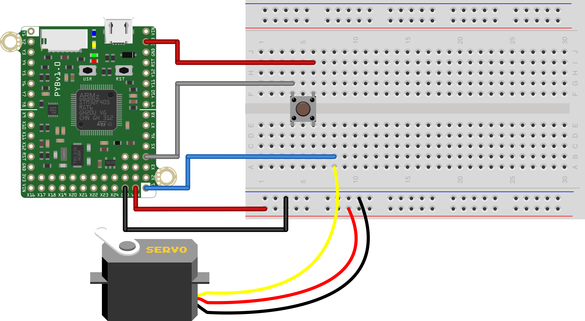

This script is one way to solve the 10th in-class exercise from MCHE201 in the 
spring semester of 2018. 

That exercise was given as:
* Connect
  - a pushbutton
  - the servomotor
* Start the servo at 0deg
* When the pushbutton is pressed, move the servo
* Only allow this to happen once per 30seconds

In this version of the solution, check for the status of the button 
repeatedly. Once it is pressed, we move the servo then sleep for 30s. This is
not the most generalizable way to do this, but it does solve the problem at 
hand. 

To generalize, you need to allow for other operations during the 30 seconds.
These could happen inside the "button pressed" part of the code, in place of
the pure sleep. For the final contest, you might still want long-ish delay
here to prevent your machine from re-running if a trial.

The hardware to run this script without modification is shown below. 

