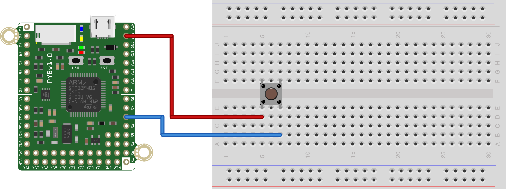

This script is one way to solve what is typically the 4th in-class exercise from [MCHE201: Introduction to Engineering Design](http://www.ucs.louisiana.edu/~jev9637/MCHE201.html).

That exercise was given as:
> When the external pushbutton is pressed, turn on one of the onboard LEDs. When it is not pressed, the LED should be off.

In the hardware configuration shown below, this script is used to read the status of a momentary pushbutton and set the status of the LED according to its state.

