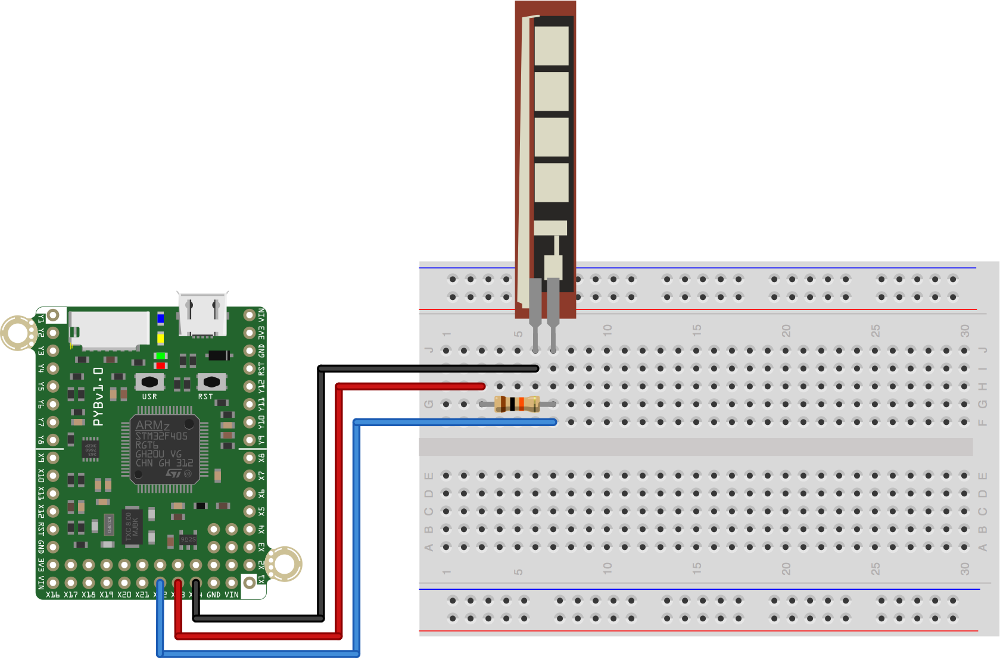

This script is one way to solve what is typically the 5th in-class exercise from [MCHE201: Introduction to Engineering Design](http://www.ucs.louisiana.edu/~jev9637/MCHE201.html).

That exercise was given as:
  * Divide the flex sensor range into four
  * Turn on the same number LEDs as the "range number" of the current state 
    of the flex sensor.
  * In other words, when the sensor is not bent, no LEDs should be on. When 
    it's bent a little, one LED should turn on. When it's bent to its 
    maximum, all 4 LEDs should be on.

The sensor is connected to the pin X22 on the pyboard and should have a pull-up resistor of 10K connected to it as well. The other pin of the flex sensor should be connected to ground.

For this exercise, the pattern that the LEDs should follow is:

|   |   |   |   |  Center  |   |   |   |   |
| - | - | - | - | :------: | - | - | - | - |
| 4 | 3 | 2 | 1 |    0     | 1 | 2 | 3 | 4 |

where the number represents the number of LEDs on. We can see from this
chart that there are 4.5 "zones" on either side of the center. With the 
middle, "0 LED on" zone split evenly between the two bend directions.

We'll assume that the flex sensor reading varies linearly with how far it 
is bent to determine the numerical values for these ranges. *Note:* This is 
generally *not* true. To improve the performance of this script, you would
want to consult the specification sheet of the sensor or experimentally
determine the relationship between flex and resistance. From that data, 
you could better tune these ranges.

The hardware setup is shown below.

