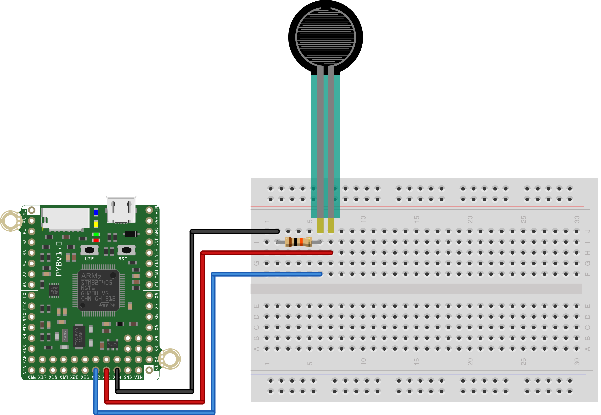

This script is one way to solve the 6th in-class exercise from MCHE201 in the spring semester of 2018.

That exercise was given as:
* Vary the intensity of the onboard blue LED based on how hard you are 
   pressing on the FSR
* Pressing harder should make the light brighter

The pin connected to Pin X22 on the pyboard, should have a pull-down resistor of 10K connected to it as well. The other pin of the FSR flex sensor should be connected to 3.3V, as shown below.

There are a few constants defined in the code that should be based on the FSR you're using. These likely need to be tuned based on your particular setup.
* Determine the `MIN_VALUE` by connecting the sensor and not touching it. It should be near zero, but will likely not be exactly zero.    
* Determine the `MAX_VALUE` by squeezing the sensor as hard as you can. This value should not exceed 4095.   

Using these values, map the range of sensor readings to these numbers. We'll make a simple linear mapping between the ADC readings and the acceptable range for the `LED.intensity()` method, which is 0-255. When we do that calculation, we need to convert the result to an integer, as the `LED.intensity()` method only accepts linear values. To do so, we wrap the calculation in `int()`:

    brightness = int(SLOPE * fsr_value + INTERCEPT) 
    
*Note:* With this simple mapping, the brightness will not seem to vary linearly to your eye. Our eyes do not map the intensity of light that way. The [wikipedia page on Luminous intensity](https://en.wikipedia.org/wiki/Luminous_intensity) has a nice overview of our perception of light.