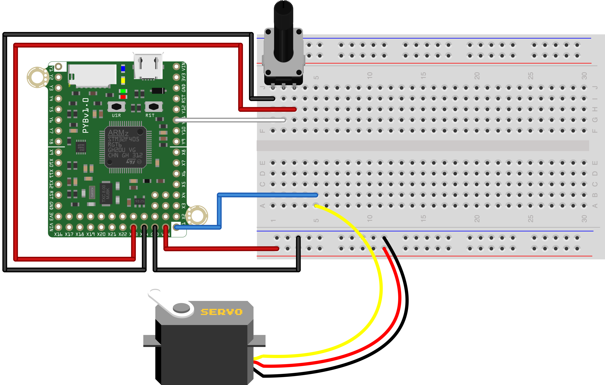

This script is one way to solve what is typically the 7th in-class exercise from [MCHE201: Introduction to Engineering Design](http://www.ucs.louisiana.edu/~jev9637/MCHE201.html).

That exercise was given as:
 * Attach a potentiometer
 * Have the servo angle track the angle of the potentiometer
 
The script uses a simple linear mapping between the 0-4095 range of possible ADC values from the potentiometer to the range of minimum to maximum angles of the servo range. This mapping is done in the function `potADCtoServoAngle`, which takes the ADC reading from the potentiometer as input and returns an angle in degrees to move the servo to.

The servo motor should connected to the `pyb.Servo(1)` pin on the pyboard.
The physical pin that this corresponds to on the version of the pyboard that you have. The mapping is shown in the table below.

Object Number | pyboard Pin | pyboard LITE pin  
------------- | :---------: | :--------------:
pyb.Servo(1)  | X1          | X3  
pyb.Servo(2)  | X2          | X4  
pyb.Servo(3)  | X3          | X1  
pyb.Servo(4)  | X4          | X2  

The configuration to run this script without modification for the pyboard is shown below.

