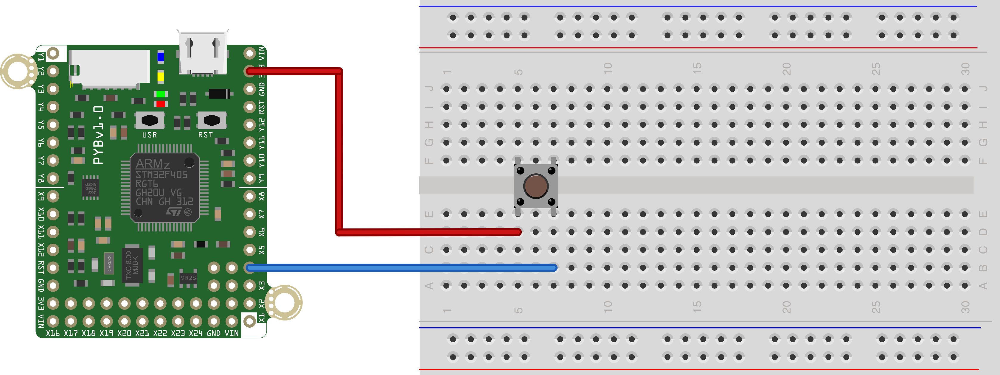

This script is one way to solve the 9th in-class exercise from MCHE201 in the spring semester of 2018. 

That exercise was given as:
* Connect a pushbutton
* Turn on the green LED
* Once the button is pressed the first time, turn off all LEDs. 
* Then, turn on 1 LED every 10s until the button is pressed again
* When the button is pressed again, print the time elapsed between button pressed to the REPL
* If more than 5s elapses:
    - Print "You took too long!!!" to the REPL
    - Turn on only the green LED again

In this version of the solution, we use nested loops check for the status of the button. To prevent multiple readings of the same button press, we have to be careful with the timing. Even so, this solution is somewhat fragile to how fast/long the user presses the button for each transition change. There will be a limit, but you could perhaps tune this solution to be more robust by changing the values in the various `time.sleep_ms()` commands. There will be a limit, but you could perhaps tune this solution to be more robust by changing the values in the various `time.sleep_ms()` function calls.

We keep track the time elapsed since the first press of the button and turn on an LED every second until the 5s limit is up. So, the LEDs serve as a progress bar on the timer.

The hardware to run this script without modification is shown below. 

