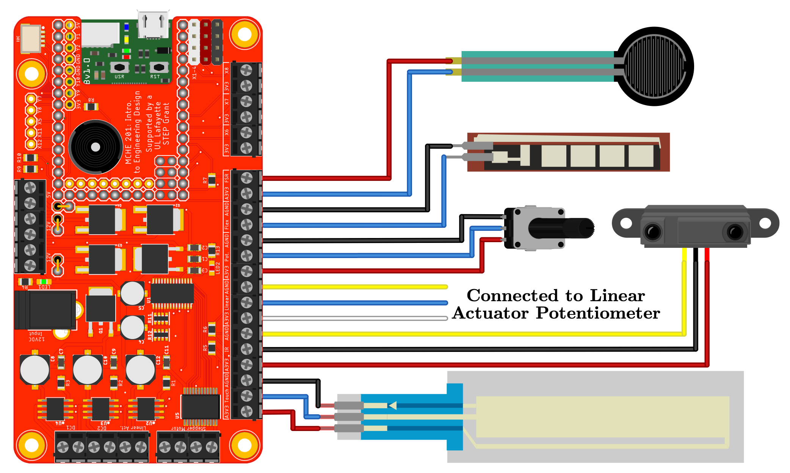

This simple script to reads the all of the analog inputs on the MCHE201 Controller board. It also reads the [ADCall information on the pyboard](https://docs.micropython.org/en/latest/library/pyb.ADC.html#the-adcall-object).

The hardware setup to use this script is shown below.

