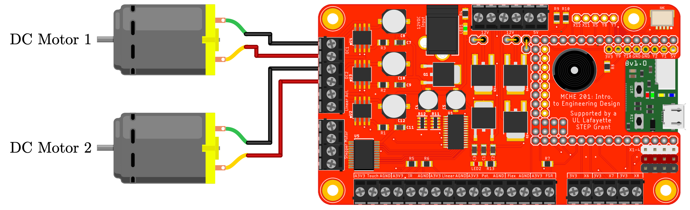

This script demonstrates the basic functionality of a DC motor connected to the MCHE201 Controller board.

This code requires the `.py` files from the [MCHE201 Controller Board repository](https://github.com/DocVaughan/MCHE201_Controller) to be on the pyboard.

The hardware setup to use this script is shown below.

