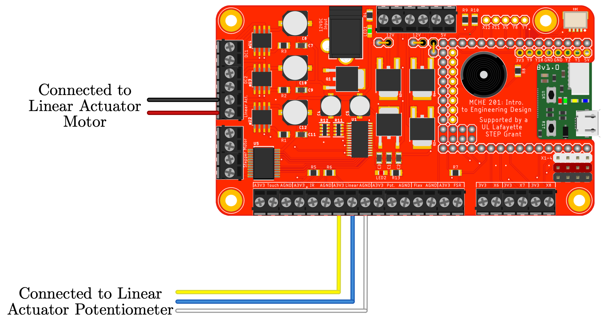

This script to demonstrates the basic functionality of the linear actuator included in the MCHE201 kit using the pyboard connected to the MCHE201 controller board.

The linear actuator actually has a DC motor inside, so we control it using the same commands that we would issue to a DC motor.

The linear actuator also a potentiometer that can give us information about the position of the actuator. This script does not utilize that information.

This code requires the `.py` files from the [MCHE201 Controller Board repository](https://github.com/DocVaughan/MCHE201_Controller) to be on the pyboard.

The hardware setup to use this script is shown below.

