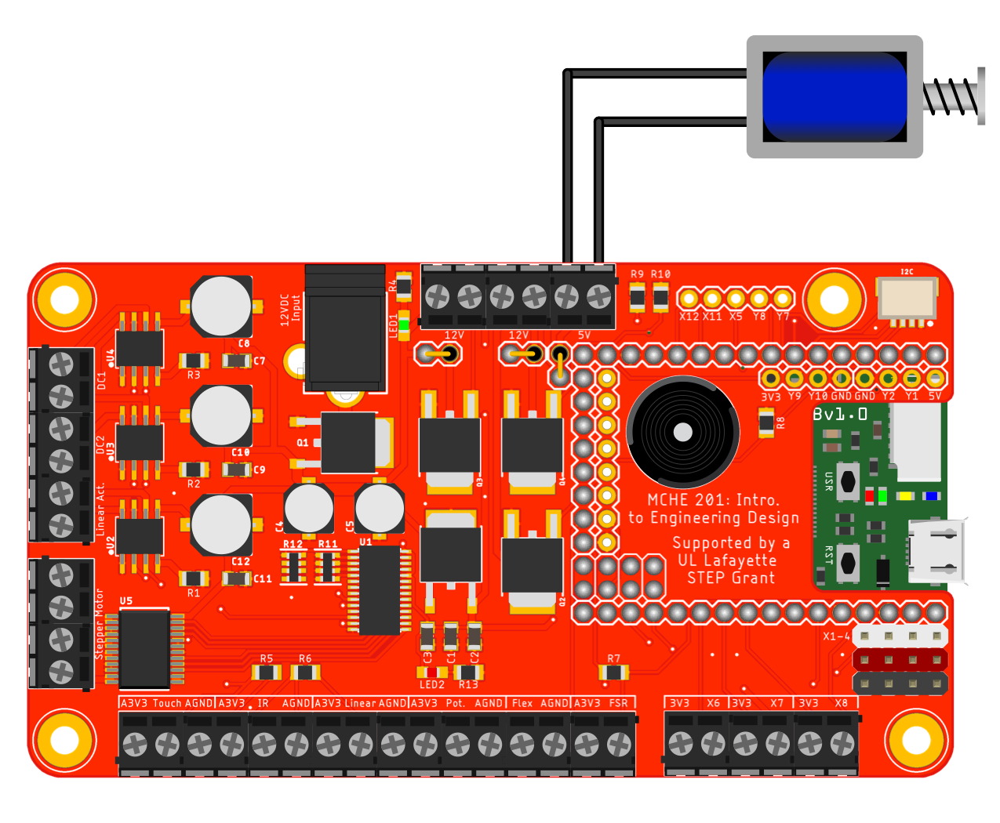

This script simply to toggles a digital output on/off. In this case, we are using it to control a MOSFET, which is acting like a on/off switch for controlling a 5V, spring-return solenoid. [This article](http://bildr.org/2012/03/rfp30n06le-arduino/) explains the concept in a straighforward way.

***IMPORTANT:*** Do *NOT* leave the small solenoid in the MCHE201 kit on for extended periods of time. You will damage it.

The hardware configuration to run this script on the MCHE201 controller board is shown below.

