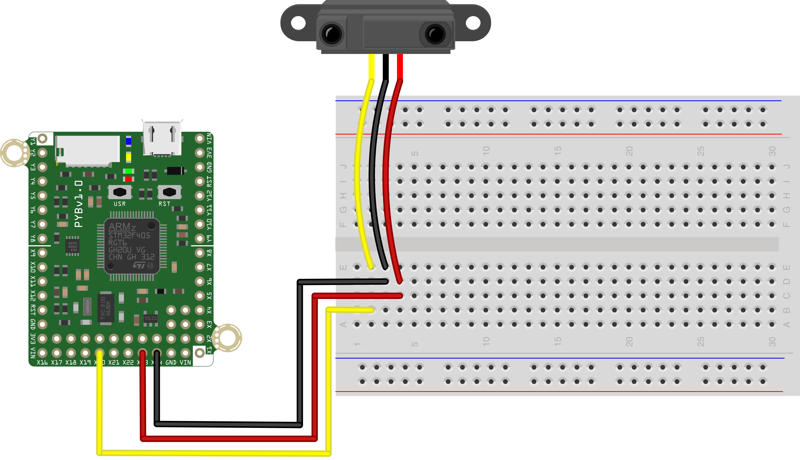
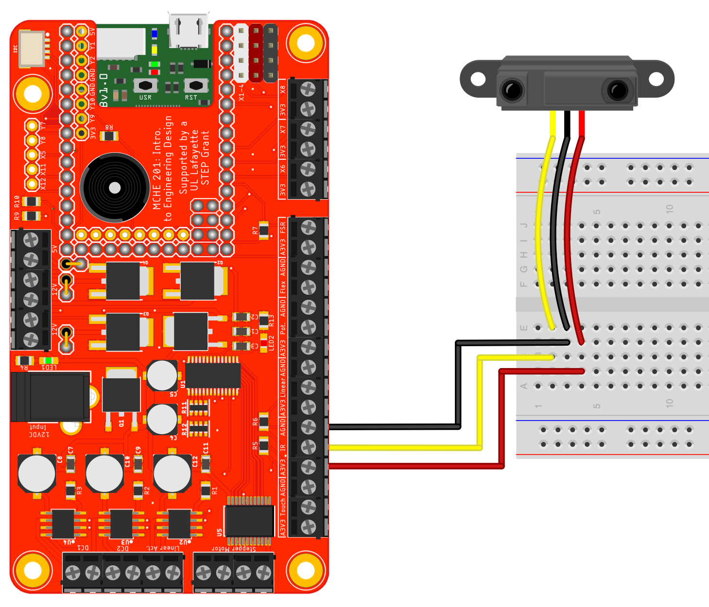

This simple script to reads the value of an IR sensor every 500ms and prints 
its value to the REPL. The yellow cable from the sensor should be connected 
to Pin X20 on the pyboard, as shown below.

This script will also work as is with the MCHE201 controller board with the hardware configuration shown in the figure below.

The sensor in the MCHE201 kit is a Sharp GP2Y0A41SK_E. It is designed to sense objects between 4 and 30cm, and outputs approximately 3.1V at 4cm and 0.3V at 30cm.
 
There is a nonlinear relationship between these values, which is given in the [Sensor datasheet](http://www.sharp-world.com/products/device/lineup/data/pdf/datasheet/gp2y0a41sk_e.pdf). The 
[Sensor Application Note](http://www.sharp-world.com/products/device/lineup/data/pdf/datasheet/gp2y0a_gp2y0d_series_appl_e.pdf) has additional information, as well.

In this script, the relationship between the output voltage and distance from the data sheet was used fit a curve and generate and equation approximating that relationship. It is used in this script to estimate the distance of the object closest to the sensor. Remember that the sensor can only be "trusted" inside the range of distances that it was designed to work on.

We also filter the incoming data to generate a estimate of distance that should be less noisy than the raw data from the sensor. Do do so, we calculate the filtered value according to:

`filtered_value = alpha * last_filtered_value + (1-alpha) * current_reading`

where `0 < alpha < 1`. For larger values of `alpha` past readings are valued more, meaning the sensor output is smoothed more aggressively. This can be tuned by changing alpha. Other sensor inputs can be filtered in a similar way; this method is not limited to the IR sensor in the MCHE201 kit.

For more information on the [Exponential Moving Average (EMA) wikipedia page](https://en.wikipedia.org/wiki/Moving_average#Exponential_moving_average).
 
*Note:* The `alpha` in the Wikipedia entry is actually the `(1-alpha)` term of the formulation shown here.