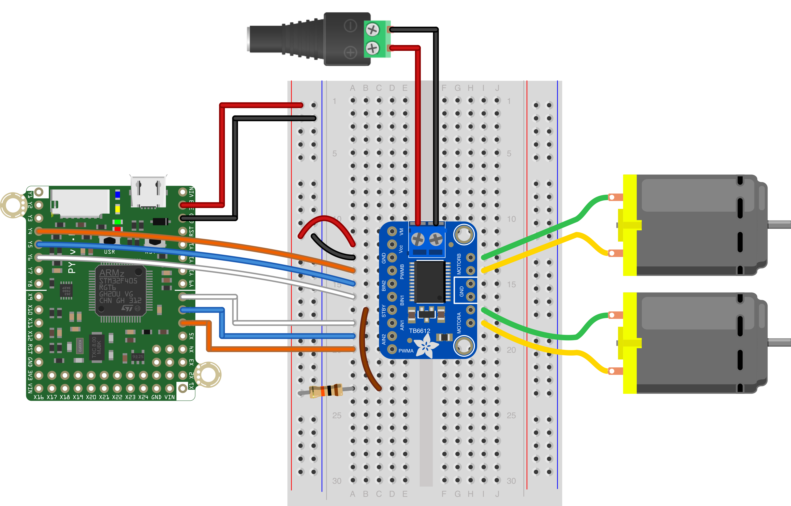
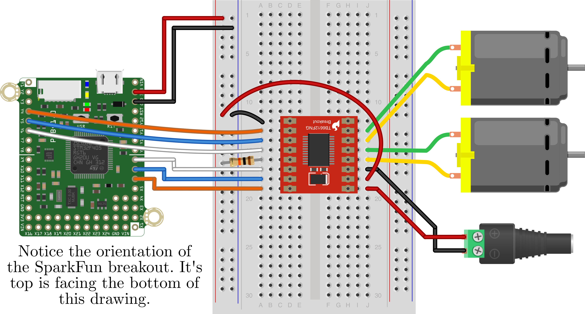

This simple script demonstrates basic control of two brushed DC motors using a [Toshiba TB6612 motor driver](https://cdn-shop.adafruit.com/datasheets/TB6612FNG_datasheet_en_20121101.pdf). This code has been tested with the  [Adafruit](https://www.adafruit.com/product/2448) and [SparkFun](https://www.sparkfun.com/products/14451) breakout boards for this chip. In this script, the motors should spin one direction at ~1/2 speed for two seconds, stop briefly, then spin at ~1/2 speed in the opposite direction for two seconds.

This version uses the file `TB6612.py` to establish a class with some convenience functions for controlling a motor. It needs to be copied to the pyboard in order for this to work.

Like we do in this code, always stop the motor before reversing directions.

The standby pin, labeled STBY, needs to be pulled up to VCC (3V3 from the pyboard in this case) via a 10K resistor.

The hardware configuration to run this script without any modification for the Adafruit and SparkFun breakout boards is shown below. The selection of pins in the example should work on both the pyboard and pyboard LITE.

