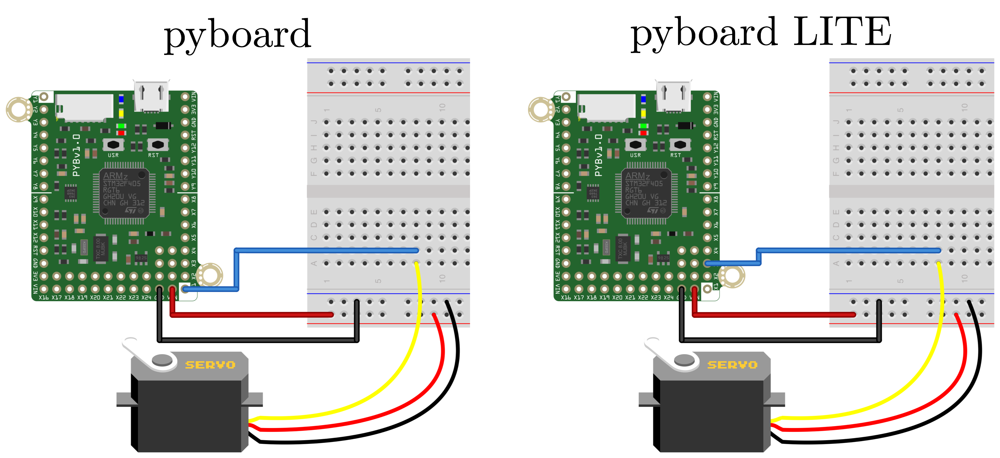
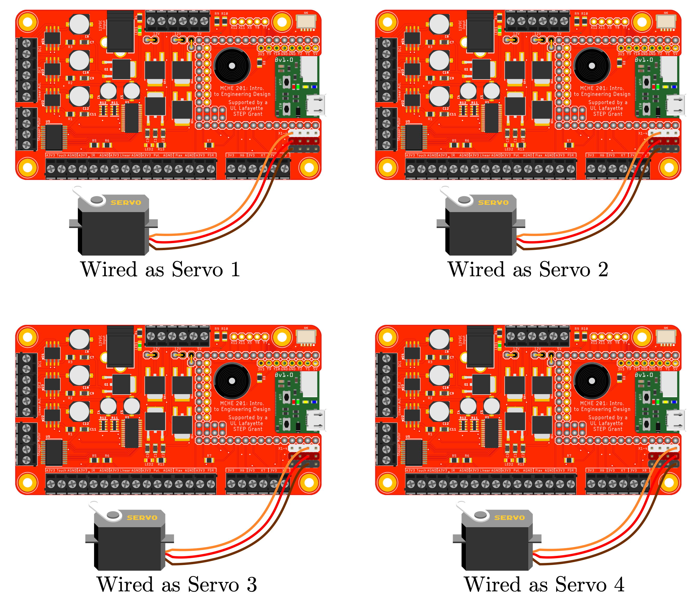

Script to run a servo motor connected to the `pyb.Servo(1)` pin on the pyboard.
The physical pin that this corresponds to on the version of the pyboard that you have. The mapping is shown in the table below.

Object Number | pyboard Pin | pyboard LITE pin  
------------- | :---------: | :--------------:
pyb.Servo(1)  | X1          | X3  
pyb.Servo(2)  | X2          | X4  
pyb.Servo(3)  | X3          | X1  
pyb.Servo(4)  | X4          | X2  

The configurations to run this script without modification for the pyboard and pyboard LITE are shown below.

This script will also work as is with the MCHE201 controller board with the hardware configuration shown in the figure below.

This code is adapted from that at: 
 http://docs.micropython.org/en/latest/pyboard/pyboard/tutorial/servo.html

