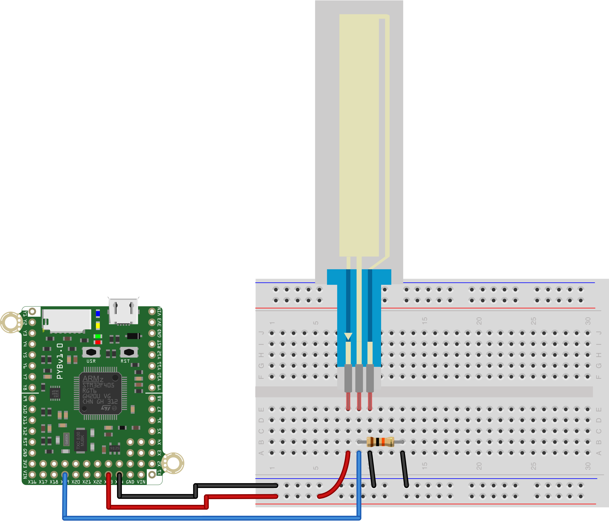
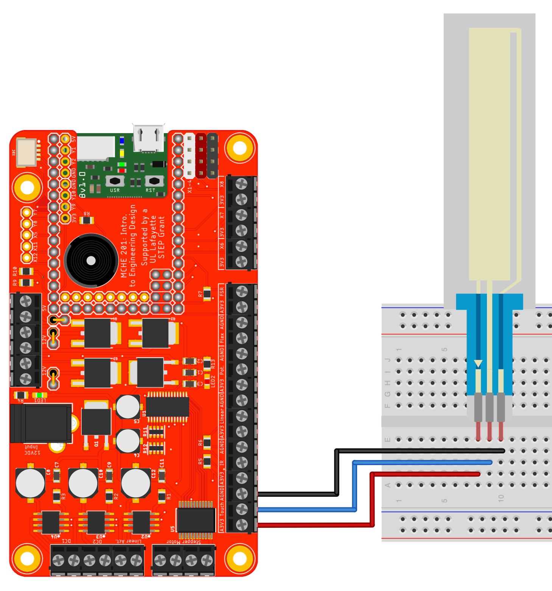

This simple script to reads the value of a soft potentiometer every 500ms and prints its value to the REPL. The middle-pin should be connected to Pin X19 on 
the pyboard, and have a pull-down resistor of 10K connected to it as well. 
One of the other pins should be connected to 3.3V, and the final pin to 
ground, as shown below.

This script will also work as is with the MCHE201 controller board with the hardware configuration shown in the figure below.

