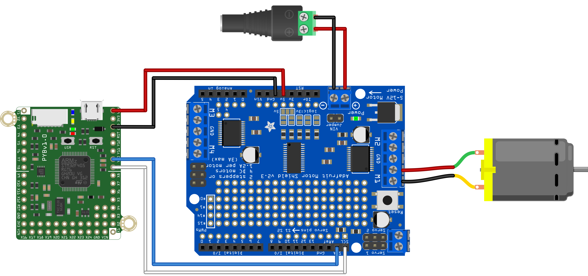

This script to demonstrates one method to smoothly start and stop a DC motor using the pyboard connected over i2c to a Adafruit Motor Driver Shield. An Exponential Moving Average (EMA) is used to smooth sudden changes in desired
motor speed.

We set the current speed command `speed` by:

`speed = alpha * last_speed + (1-alpha) * desired_speed`

where `0 < alpha < 1`. For larger values of `alpha` past inputs are valued more, meaning the response is smoothed more aggressively. So, the speed of the response can be tuned by changing alpha. For example, to respond to a step change of speed, reaching 90% of the desired value in `N` time steps, `alpha` can be chosen according to:

` alpha = 1 - 2 / (N+1) `

For more information on the Exponential Moving Average (EMA), see:
 https://en.wikipedia.org/wiki/Moving_average#Exponential_moving_average

This code requires the .mpy files from the [Adafruit repository](https://github.com/adafruit/micropython-adafruit-pca9685) to be on the pyboard.
 
For more information see:
https://learn.adafruit.com/micropython-hardware-pca9685-dc-motor-and-stepper-driver

The circuit on the shield is identical to the Feather board shown in that tutorial.

The hardware setup to use this script is shown below.

