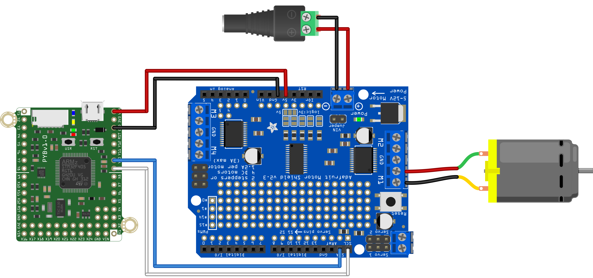

This script demonstrates the basic functionality of a stepper motor using the pyboard connected over i2c to an Adafruit Motor Driver Shield.

This code requires the .mpy files from the [Dr. Vaughan's fork of the Adafruit repository](https://github.com/DocVaughan/micropython-adafruit-pca9685) to be on the pyboard. Be sure to get the files from the release corresponding to the version of MicroPython that you are using.
 
For more information see:
https://learn.adafruit.com/micropython-hardware-pca9685-dc-motor-and-stepper-driver

The circuit on the shield is identical to the Feather board shown in that tutorial.

The hardware setup to use this script is shown below.

