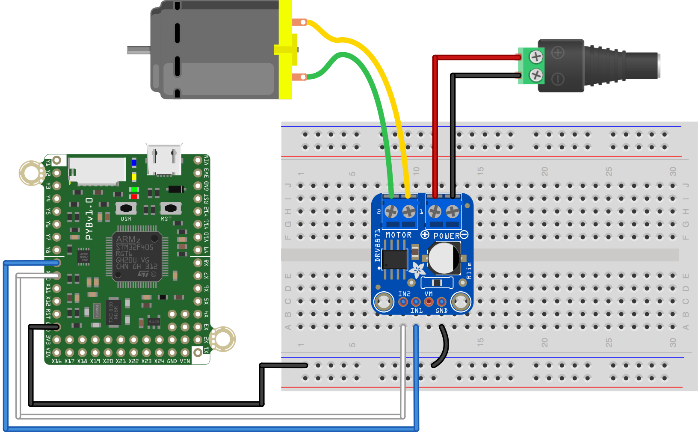

This simple script demonstrates basic control of a brushed DC motor using a [Texas Instruments DRV8871 motor driver](http://www.ti.com/product/DRV8871). The [Adafruit breakout board](https://www.adafruit.com/product/3190) for this chip is used. In this script, the motor should spin one direction at ~3/4 speed for two seconds, stop briefly, then spin at ~3/4 speed in the opposite direction for two seconds.

Like we do in this code, always stop the motor before reversing directions.

The hardware configuration to run this script without any modification is shown below. The selection of pins in the example should work on both the pyboard and pyboard LITE.

