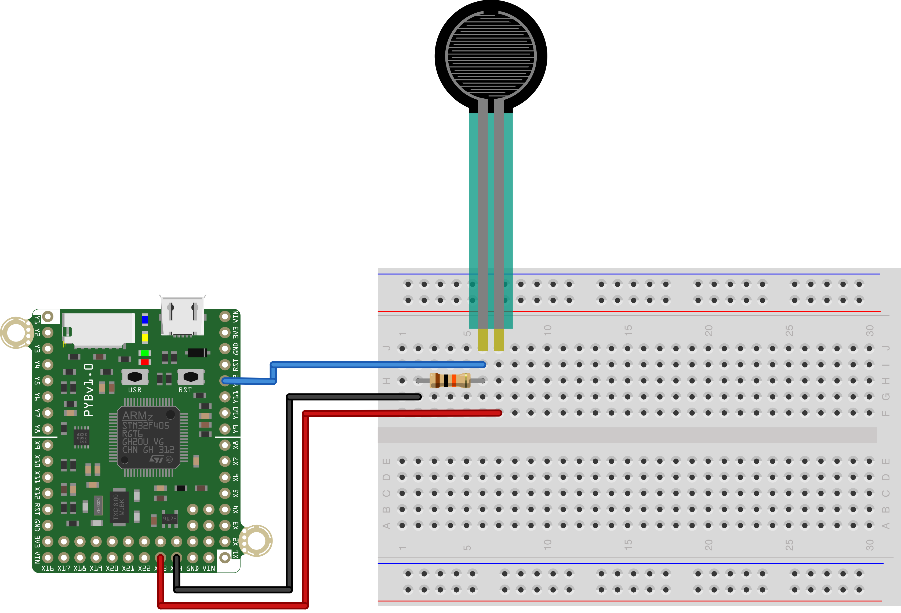

This simple script to reads the value of a Force Sensitive Resistor (FSR) every 500ms and print  its value to the REPL. The sensor is connected to Pin Y12 on the pyboard and should have a pull-down resistor of 10K connected to it as well. The other pin of the FSR flex sensor should be connected to 3.3V, as shown in the figure below.

