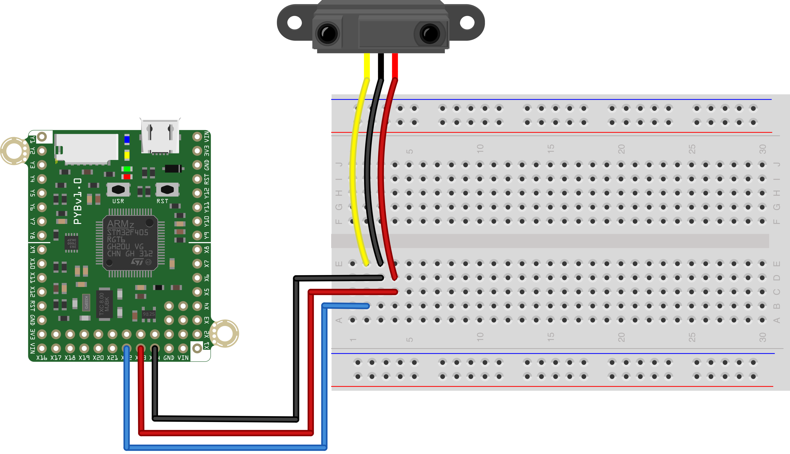

This simple script to reads the value of an IR sensor every 500ms and prints 
its value to the REPL. The yellow cable from the sensor should be connected 
to Pin X20 on the pyboard, as shown below.

The sensor in the MCHE201 kit is a Sharp GP2Y0A41SK_E. It is designed to sense objects between 4 and 30cm, and outputs approximately 3.1V at 4cm and 0.3V at 30cm.
 
There is a nonlinear relationship between these values, which is given in the [Sensor datasheet](http://www.sharp-world.com/products/device/lineup/data/pdf/datasheet/gp2y0a41sk_e.pdf). The 
[Sensor Application Note](http://www.sharp-world.com/products/device/lineup/data/pdf/datasheet/gp2y0a_gp2y0d_series_appl_e.pdf) has additional information, as well.

In this script, the relationship between the output voltage and distance from the data sheet was used fit a curve and generate and equation approximating that relationship. It is used in this script to estimate the distance of the object closest to the sensor. Remember that the sensor can only be "trusted" inside the range of distances that it was designed to work on.