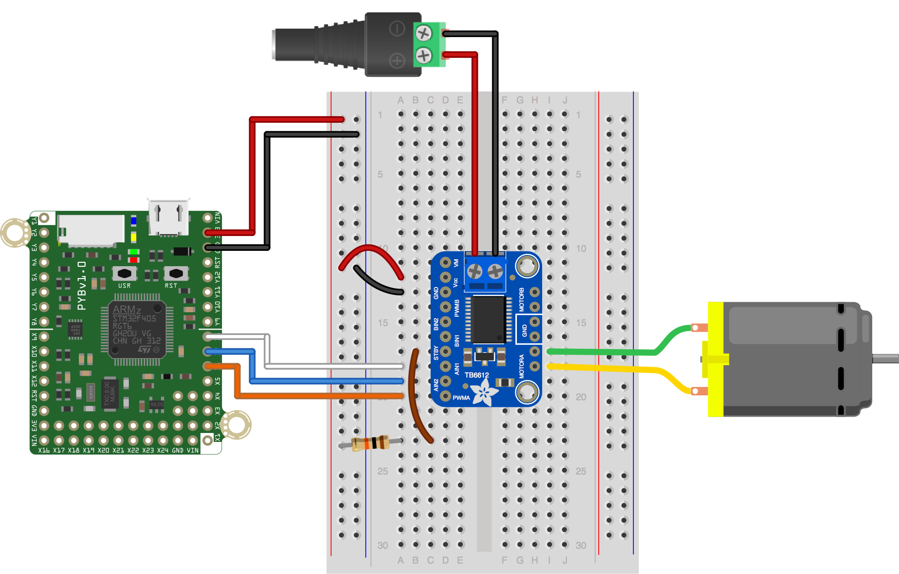
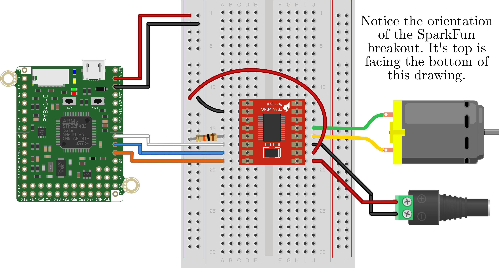

This simple script demonstrates basic control of a brushed DC motor using a [Toshiba TB6612 motor driver](https://cdn-shop.adafruit.com/datasheets/TB6612FNG_datasheet_en_20121101.pdf). This code has been tested with the  [Adafruit](https://www.adafruit.com/product/2448) and [SparkFun](https://www.sparkfun.com/products/14451) breakout boards for this chip. In this script, the motor should spin one direction at ~1/2 speed for two seconds, stop briefly, then spin at ~1/2 speed in the opposite direction for two seconds.

Like we do in this code, always stop the motor before reversing directions.

For the TB6612 motor driver, the direction of the motor is controlled via the IN1 and IN2 for each of the two channels. In other words, AIN1 and AIN2 control the direction of the "MotorA" output, and BIN1 and BIN2 control the direction of the "MotorB". The speed for each motor is controlled by the corresponding PWM pin, PWMA for motor and and PWMB for motor B. Basically, to move in on direction, set IN1 high and IN0 low. To move in the other direction, set IN1 low and IN0 high. 

In addition, the standby pin, labeled STBY on the motor driver needs to be pulled up to VCC (3V3 from the pyboard in this case) via a 10K resistor.

The hardware configuration to run this script without any modification for the Adafruit and SparkFun breakout boards is shown below. The selection of pins in the example should work on both the pyboard and pyboard LITE.

