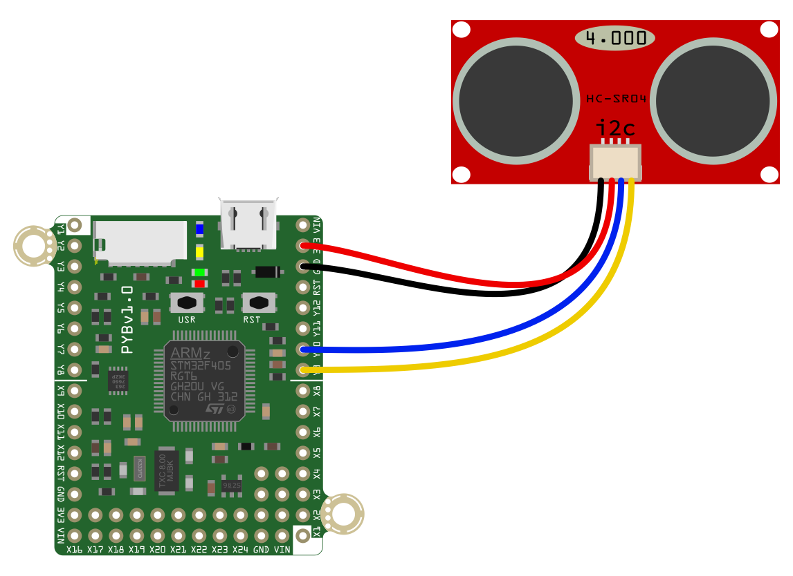
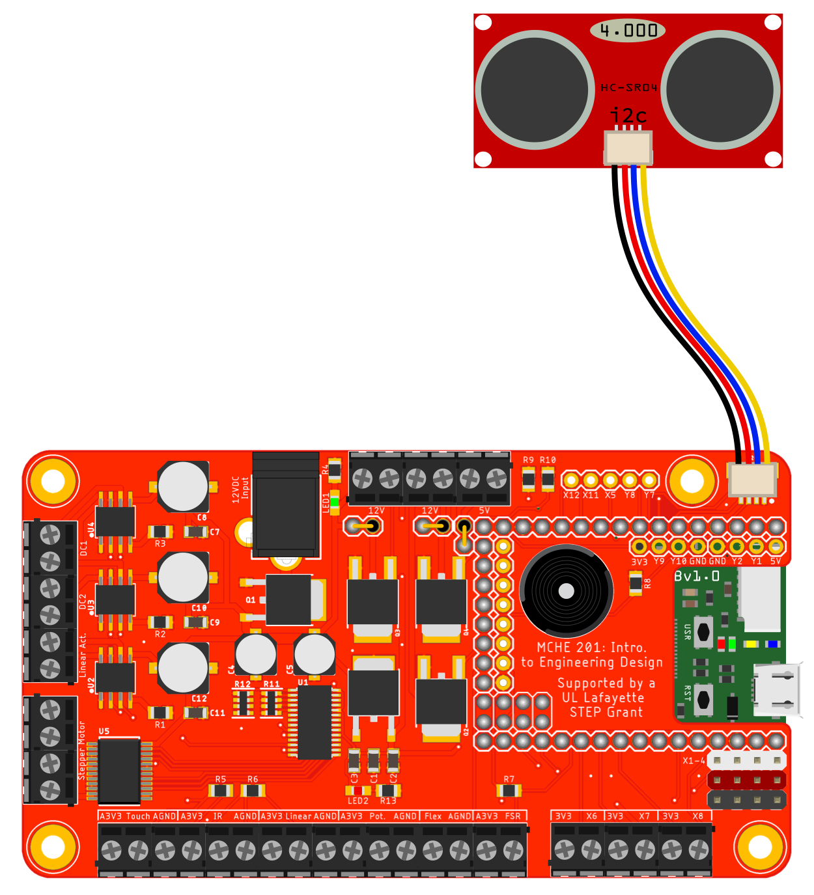

Script to demonstrate the basic functionality of the a [Zio Ultrasonic Distance](https://www.sparkfun.com/products/15171) sensor with the pyboard connected over i2c via the [SparkFun Qwiic](https://www.sparkfun.com/qwiic) system.

*Note:* You may need to check the address of your sensor and change the `SENSOR_ADDRESS` variable to match. To do so, you can issue the `i2c.scan()` method once you have initialized the i2c communication.

The hardware setups to run this script either directly with the pyboard and with the MCHE201 Controller Board are both shown below.

