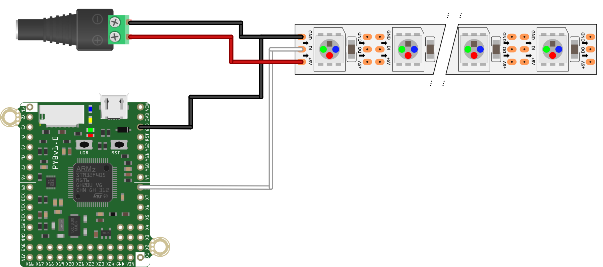

This script to demonstrates the basic functionality controlling a WS2812 RGB LED array (often called neopixels). The data line of the array should be connected to the MOSI pin of an SPI port on the board. In the code here, we use SPI1 on the pyboard, whose MOSI pin is `X8`.

This is written largely assuming the LED array is a strip. As written, it will loop set the entire strip to a dim brightness of a RGBW color, then loop through the length of the LED strip making `NUM_CYCLE` LEDs bright in that color. Once once cylce is complete, the color changes. It will do this indefinitely.

*Note:* The order of the tuples used is GRB, *NOT* RGB

The neoSPI.py file from [this library](https://github.com/nickovs/ws2812-SPI) must also be on the pyboard for this script to work.

The hardware setup to use the script as written is shown below.

