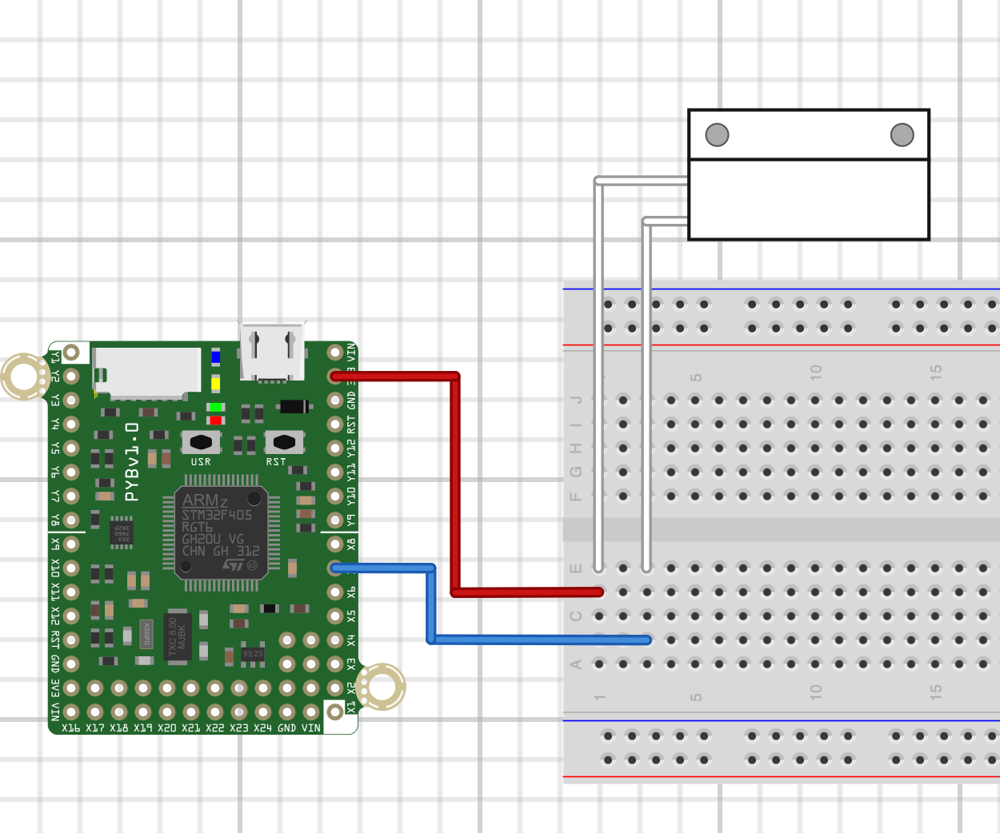
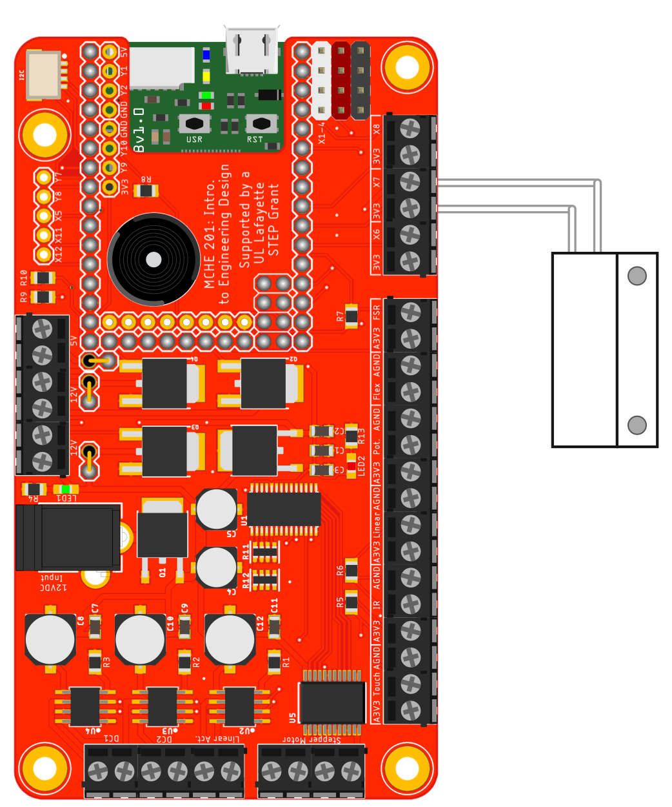

This simple script demonstrates read a digital input connected to pin X7. The internal pull-down resistor is used. In the hardware configuration shown below,
this script is used to read the status of a magnetic switch, like those used in home alarm systems. The script has been tested with switches from:

* [SparkFun](https://www.sparkfun.com/products/13247) 
* [McMaster Option 1](https://www.mcmaster.com/#8039a14)
* [MacMaster Option 2](https://www.mcmaster.com/#8039a21)

This script will also work as is with the MCHE201 controller board with the hardware configuration shown in the figure below.

