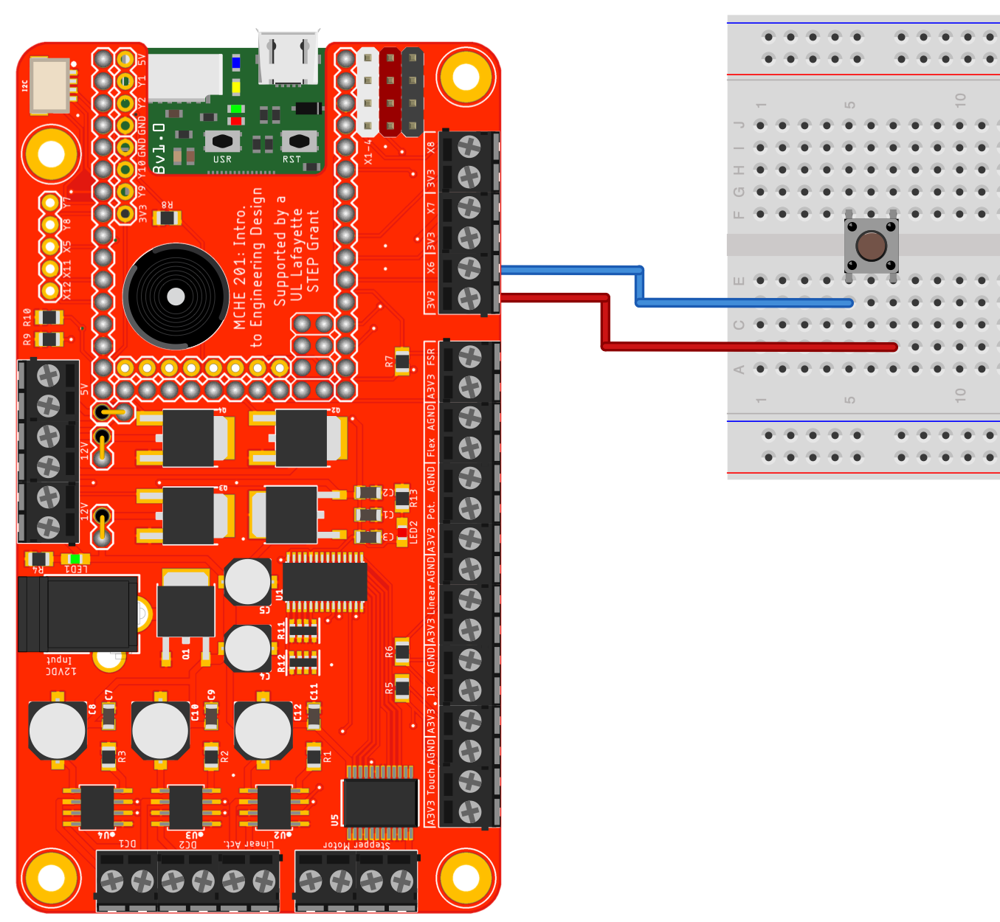

This simple script demonstrates read a digital input connected to pin X6. The internal pull-down resistor is used. In the hardware configuration shown below,
this script is used to read the status of a momentary pushbutton. 

This script will also work as is with the MCHE201 controller board with the hardware configuration shown in the figure below.

