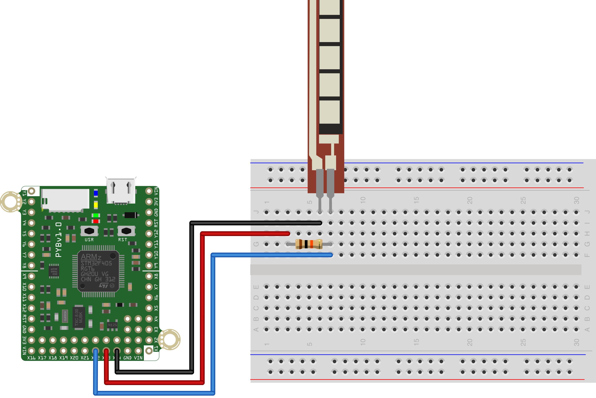

This simple script reads the value of a flex sensor every 500ms and prints 
its value to the REPL. The sensor is connected to the pin X22 on the pyboard and should 
have a pull-up resistor of 10K connected to it as well. The other pin of the
flex sensor should be connected to ground.

The hardware setup is shown below.

