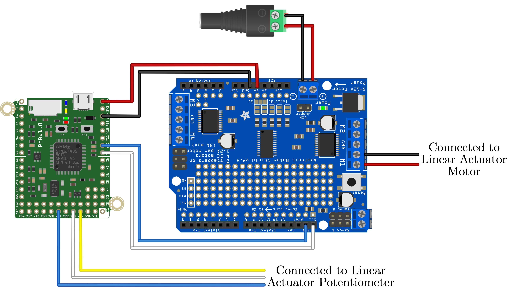

This script to demonstrates the basic functionality of the linear actuator included in the MCHE201 kit using the pyboard connected over i2c to an Adafruit Motor Driver Shield.

The linear actuator actually has a DC motor inside, so we control it using the same commands that we would issue to a DC motor.

The linear actuator also a potentiometer that can give us information about the position of the actuator. This script does not utilize that information.

This code requires the .mpy files from the [Adafruit repository](https://github.com/adafruit/micropython-adafruit-pca9685) to be on the pyboard.
 
For more information see:
https://learn.adafruit.com/micropython-hardware-pca9685-dc-motor-and-stepper-driver

The circuit on the shield is identical to the Feather board shown in that tutorial.

The hardware setup to use this script is shown below.

