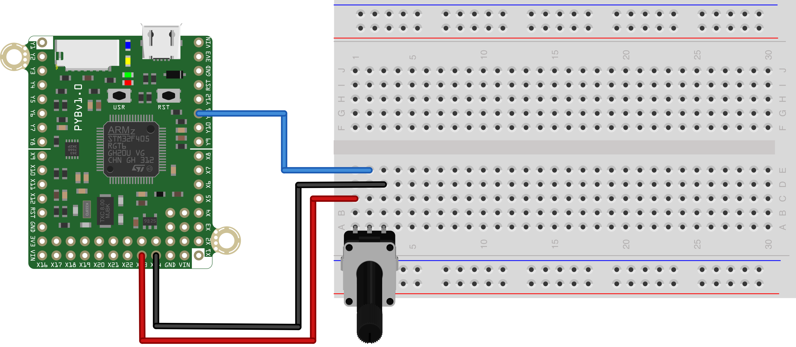

This simple script to reads the value of a potentiometer every 500ms and print its value to the REPL. The "middle" pin of the potentiometer should be 
connected to Pin X22 on the pyboard. One of the outer pins should be connected to A3V3 (Pin X23) and the other to AGND (PIN X24), as shown below.

