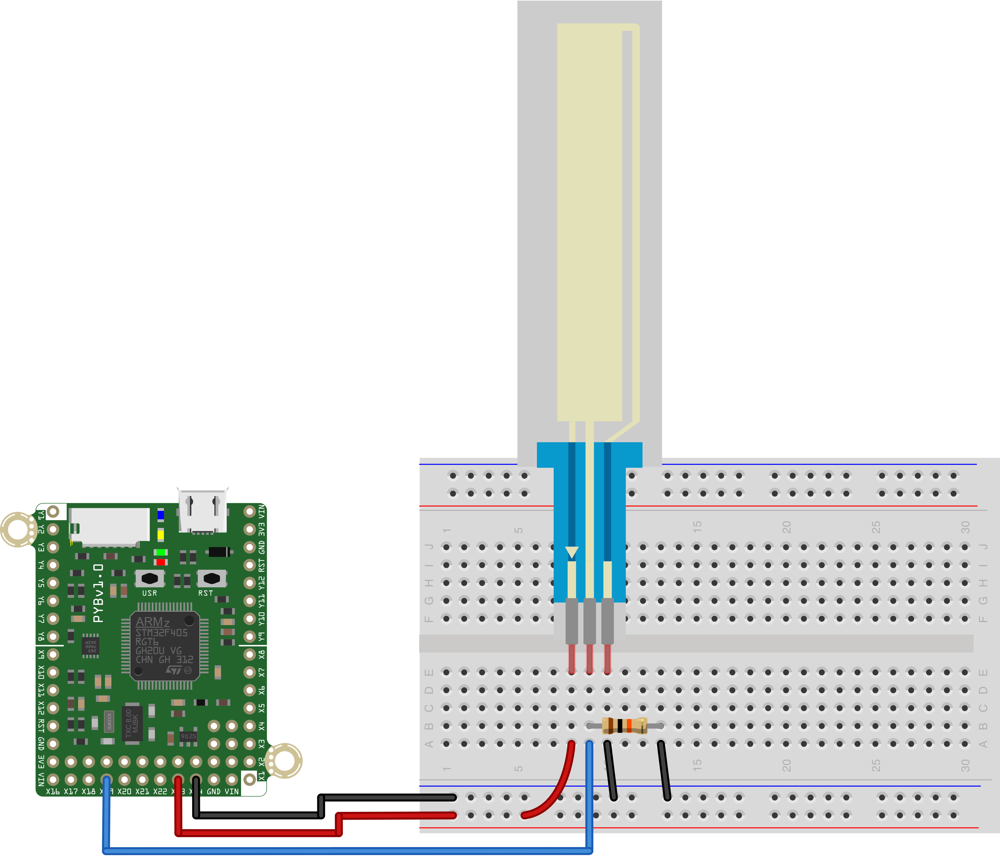

This simple script to reads the value of a soft potentiometer every 500ms and prints its value to the REPL. The middle-pin should be connected to Pin X22 on 
the pyboard, and have a pull-down resistor of 10K connected to it as well. 
One of the other pins should be connected to 3.3V, and the final pin to 
ground, as shown below.

