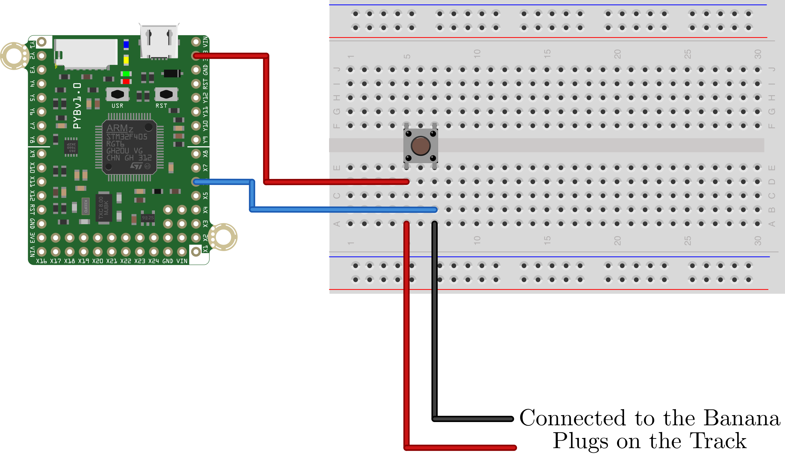

This is a template script showing how to start a device based on the start signal closing. It assumes that the external digital input connected to pin X4. The internal pull-down resistor is used. In this version, we manually poll the status of the digital input connected to pin X4. 

The hardware configuration is shown below.

