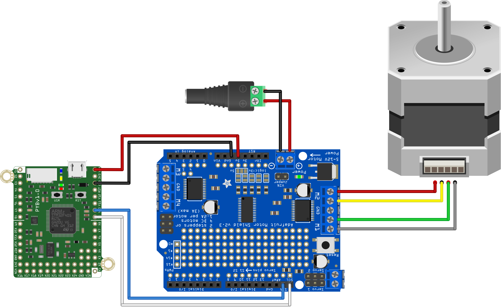

This script demonstrates the basic functionality of a stepper motor using the pyboard connected over i2c to a Adafruit Motor Driver Shield, showing the various step modes available.

This code requires the .mpy files from the [Adafruit repository](https://github.com/adafruit/micropython-adafruit-pca9685) to be on the pyboard.

For more information see:
https://learn.adafruit.com/micropython-hardware-pca9685-dc-motor-and-stepper-driver

The circuit on the shield is identical to the Feather board shown in that tutorial.

The [motors in the MCHE 201 kits](https://www.adafruit.com/product/324) have 200 steps per revolution.

The hardware configuration to run this script without modification is shown below:

