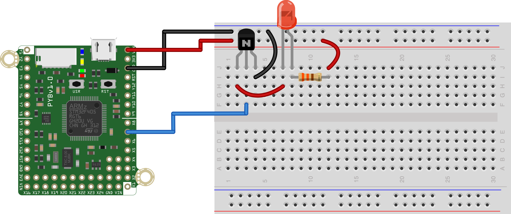

This script simply to toggles a digital output on/off. In this case, we are using it to control a transistor, which is acting like a on/off switch for an LED. As we've seen [before](https://github.com/DocVaughan/MCHE201---Intro-to-Eng-Design/tree/Fall-2018/MicroPython/pyboard%20digital%20output), the transistor to control an LED with the pyboard, but it provides an easy example setup. In general, we could a transistor to effectively switch a higher-current or higher-voltage load. When using a transistor this way, be sure to stay within its voltage and current limits. For high current or voltage loads, a [mosfet is generally a better choice](http://bildr.org/2012/03/rfp30n06le-arduino/).

The hardware configuration to run this script without any modification is shown below. The base of the NPN transistor to pin X7 of the pyboard. The [transistor in the figure](https://www.sparkfun.com/products/13689) is part of the [MCHE201 Kit](http://sfe.io/w135021) and has a "CBE" ordered pinout in the orientation shown.

