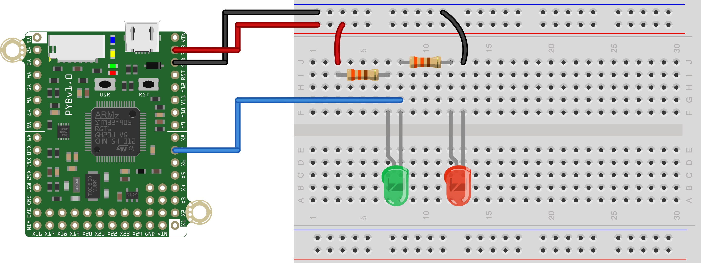

This simple script demonstrates control a digital ouptut. In the hardware configuration shown below, this script is used to control an pair of LEDs connected to pin X7 of the pyboard. In the configuration shown in the image below, when the pyboard digital output pin (GPIO) is high, one LED will be on, and when the output pin is low, the other will be on. To turn both LEDs off, we need to redefine the pin as an input. This means that we'll have to redefine the pin as an output anytime we want one of the LEDs to be on.

The hardware configuration to run this script without modification is shown below. The resistors are both 330ohm. 

 
