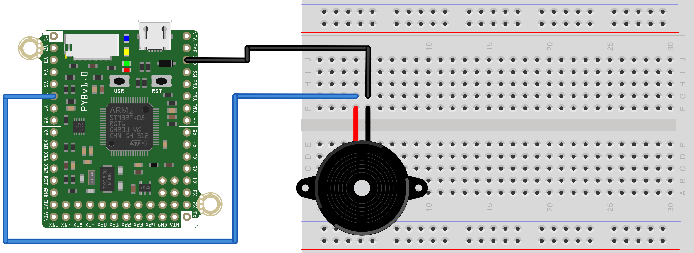

Script to play some tunes using the piezo buzzer. Connect one lead of the 
buzzer to Y6 and the other lead to ground.

On the pyboard, pin Y6 is connected to the 1st channel of Timer 1. However, on the pyboard LITE, pin Y6 is connected to the 1st channel of Timer 1.

This means that the pin setup of this code will be slightly different based
on the version board that you have. Only one set of the lines of code inside the block below should be uncommented based on the board that you have.

``` python
# ----- Set up pin PWM timer for output to the buzzer -------------------------
# 
# Within this block of code, only uncomment the 3 lines corresponding to the 
# version of the pyboard that you are using.
#
# This setup is for the pyboard. For the pyboard LITE, comment out these lines
# and uncomment those in the next block.
buzzerPin = pyb.Pin("Y6") # Pin Y1 with timer 1 Channel 1
tim = pyb.Timer(1, freq=3000)
ch = tim.channel(1, pyb.Timer.PWM, pin=buzzerPin)

# This setup is for the pyboard LITE. For the pyboard, comment out the lines
# below and uncomment those in the previous block.
# p2 = pyb.Pin("Y2") # Pin Y2 with timer 3 Channel 2
# tim = pyb.Timer(3, freq=3000)
# ch = tim.channel(2, pyb.Timer.PWM, pin=p2)
#
# ----- End of set up pin PWM timer for output to the buzzer ------------------
```

The hardware setup to use this script is shown below.



Code adapted from that at: http://wiki.micropython.org/Play-Tone