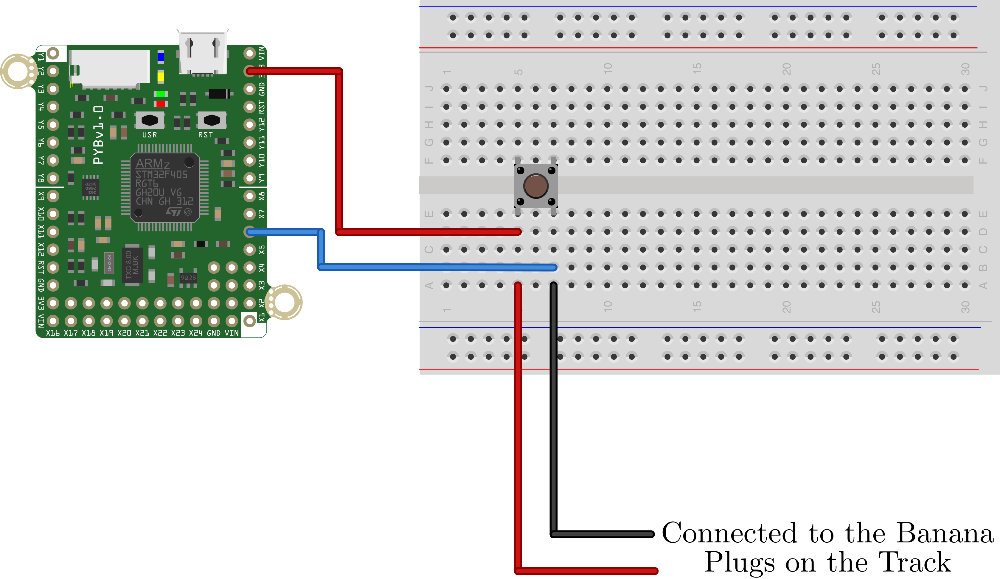
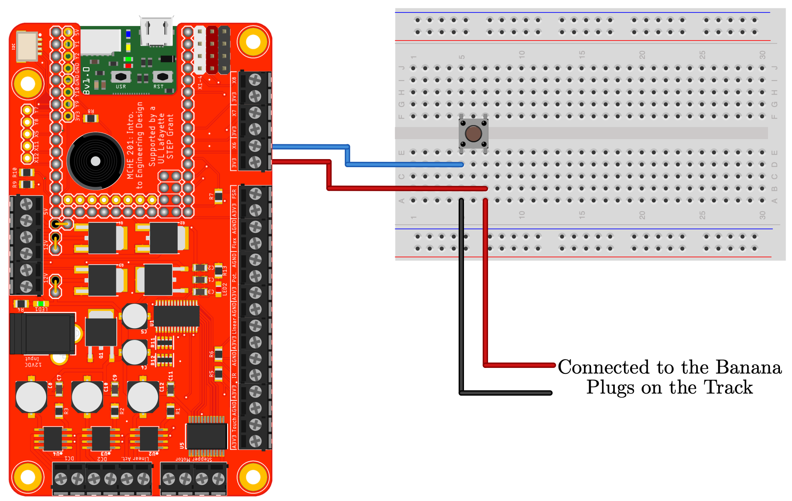
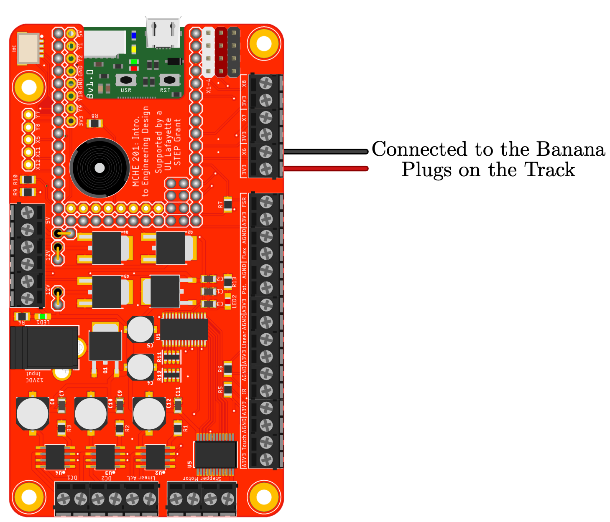

This is a template script showing how to start a device based on the MCHE201 start signal closing. It assumes that the external digital input connected to pin X6. The internal pull-down resistor is used. In this version, we use an interrupt to change the value of a flag variable. This is the more advanced way to sense a condition like this and how it would/should be done once you have some experience.

More information on external interrupts in MicroPython can be found at:

http://docs.micropython.org/en/latest/pyboard/library/pyb.ExtInt.html?highlight=interrupt

The hardware configuration is shown below.

This script will also work as is with the MCHE201 controller board with the hardware configuration shown in the figure below.

Alternately, the banana cables from the track can be connected directly to the MCHE201 controller board, as shown below.

