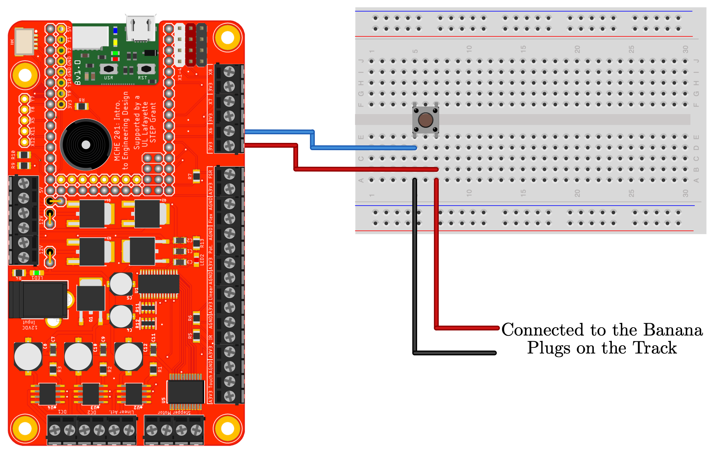
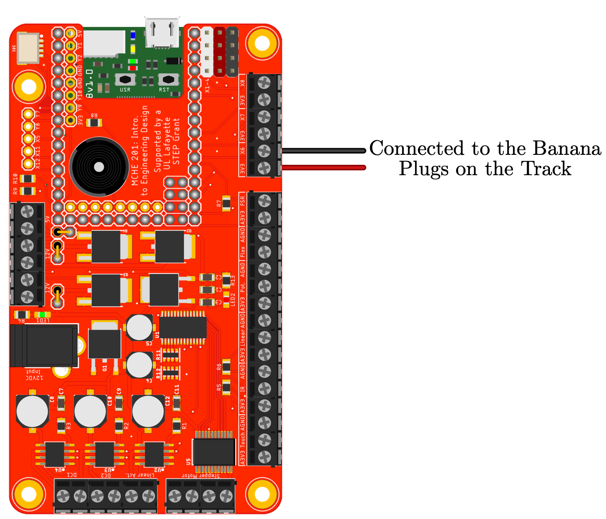

This is a template script showing how to start a device based on the start signal closing. It assumes that the external digital input connected to pin X6. The internal pull-down resistor is used. In this version, we manually poll the status of the digital input connected to pin X6. 

The hardware configuration is shown below.

This script will also work as is with the MCHE201 controller board with the hardware configuration shown in the figure below.

Alternately, the banana cables from the track can be connected directly to the MCHE201 controller board, as shown below.

